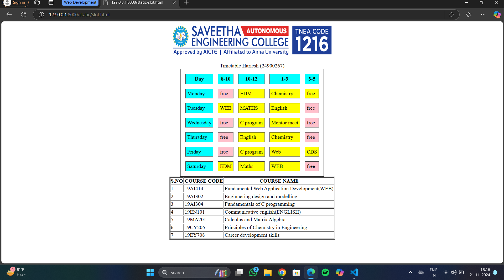

# Ex03 Time Table
## Date:21.11.24

## AIM
To write a html webpage page to display your slot timetable.

## ALGORITHM
### STEP 1
Create a Django-admin Interface.

### STEP 2
Create a static folder and inert HTML code.

### STEP 3
Create a simple table using ```<table>``` tag in html.

### STEP 4
Add header row using ```<th>``` tag.

### STEP 5
Add your timetable using ```<td>``` tag.

### STEP 6
Execute the program using runserver command.

## PROGRAM
```
<html>
    <body>
        <center>
        
        </center>
        <br>
    <table align="center" border="2"cellspacing="15"cellpadding="5">
    <caption>Timetable Hariesh (24900267)</caption>
    <tr bgcolor="cyan">
        <th>Day</th>
        <th>8-10</th>
        <th>10-12</th>
        <th>1-3</th>
        <th>3-5</th>
    </tr>
    <tr>
        <td bgcolor="cyan">Monday</td>
        <td bgcolor="pink">free</td>
        <td bgcolor="yellow">EDM</td>
        <td bgcolor="yellow">Chemistry</td>
        <td bgcolor="yellow">free</td>
    </tr>
    <tr>
        <td bgcolor="cyan">Tuesday</td>
        <td bgcolor="yellow">WEB</td>
        <td bgcolor="yellow">MATHS</td>
        <td bgcolor="yellow">English</td>
        <td bgcolor="pink">free</td>
    </tr>
    <tr>
        <td bgcolor="cyan">Wednesday</td>
        <td bgcolor="pink">free</td>
        <td bgcolor="yellow">C program</td>
        <td bgcolor="yellow">Mentor meet</td>
        <td bgcolor="pink">free</td>
    </tr>
    <tr>
        <td bgcolor="cyan">Thursday</td>
        <td bgcolor="pink">free</td>
        <td bgcolor="yellow">English</td>
        <td bgcolor="yellow">Chemistry</td>
        <td bgcolor="pink">free</td>
    </tr>
    <tr>
        <td bgcolor="cyan">Friday</td>
        <td bgcolor="pink">free</td>
        <td bgcolor="yellow">C program</td>
        <td bgcolor="yellow">Web</td>
        <td bgcolor="yellow">CDS</td>
    </tr>
    <tr >
        <td bgcolor="cyan">Saturday</td>
        <td bgcolor="yellow">EDM</td>
        <td bgcolor="yellow">Maths</td>
        <td bgcolor="yellow">WEB</td>
        <td bgcolor="pink">free</td>
    </tr>
</table>
    <table align="center" border="1">
        <tr>
            <th>S.NO</th>
            <th>COURSE CODE</th>
            <th>COURSE NAME</th>
        </tr>
        <tr>
            <td>1</td>
            <td>19AI414</td>
            <td>Fundamental Web Application Development(WEB)</td>
        </tr>
        <tr>
            <td>2</td>
            <td>19AI302</td>
            <td>Enginnering design and modelling</td>
        </tr>
        <tr>
            <td>3</td>
            <td>19AI304</td>
            <td>Fundamentals of C programming</td>
        </tr>
        <tr>
            <td>4</td>
            <td>19EN101</td>
            <td>Communicative english(ENGLISH)</td>
        </tr>
        <tr>
            <td>5</td>
            <td>19MA201</td>
             <td>Calculus and Matrix Algebra</td>
        </tr>
        <tr>
            <td>6</td>
            <td>19CY205</td>
            <td>Principles of Chemistry in Engineering</td>
            
        </tr>
        <tr>
            <td>7</td>
            <td>19EY708</td>
            <td>Career development skills</td>
        </tr>
    </table>
</body>
</html>
```

## OUTPUT


## RESULT
The program for creating slot timetable using basic HTML tags is executed successfully.
